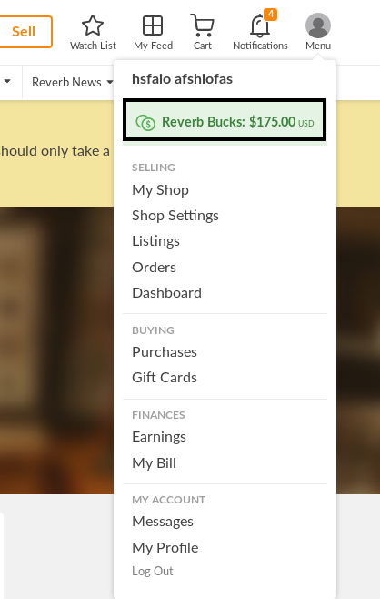

## [Race Condition allows to redeem multiple times gift cards which leads to free "money"](https://hackerone.com/reports/759247)
#race
### Summary
一个条件竞争漏洞导致可以多次领取礼品卡

### Step
1. 登录
2. 购买商品
3. 兑换礼品卡 ，抓包
4. 条件竞争 ，race.py
5. 

### Impact
零元购

## [Race condition in performing retest allows duplicated payments](https://hackerone.com/reports/429026)
#race 
### Summary
在执行重新测试时存在竞态条件。通过同时执行多个请求来确认重新测试，恶意用户可以多次获得重新测试的报酬。这使得可以从HackerOne中窃取资金，而这可能会被HackerOne和攻击者（我）都忽略。
### Step
1. 收到来自HackerOne的重新测试请求电子邮件。 
2. 拦截重新测试请求的电子邮件。在Burp Suite中右键单击请求，然后选择"Copy as curl command"（复制为curl命令）。 
3. 在命令行中执行请求，格式为(request) & (request) & ...。在测试中，我执行了该命令5次。 
4. 滚动到[https://hackerone.com/settings/bounties](https://hackerone.com/settings/bounties) 支付将显示在"Retest payments"（重新测试支付）部分，而且可能会多次出现。
5. 等待几周。如果成功，将收到来自HackerOne的回调通知（在此情况下来自@michiel）：
6. 2,500$💵
### Impact
使得攻击者可以利用重新测试功能多次窃取资金

## [Client-Side Race Condition using Marketo, allows sending user to data-protocol in Safari when form without onSuccess is submitted on www.hackerone.com]()
#race

