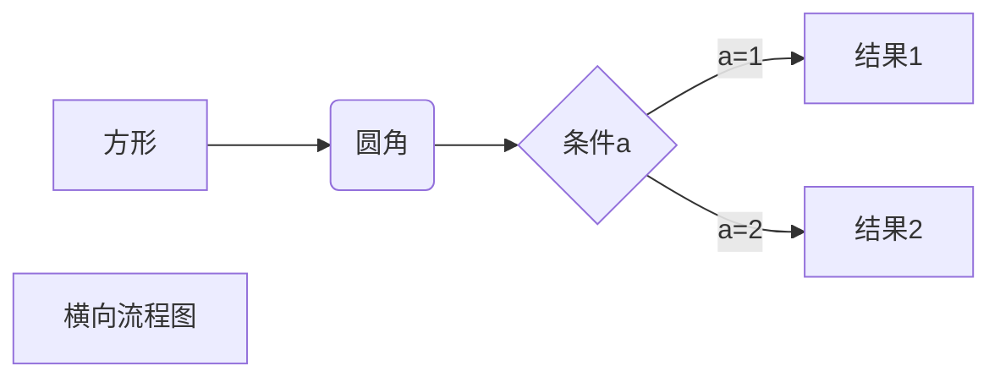
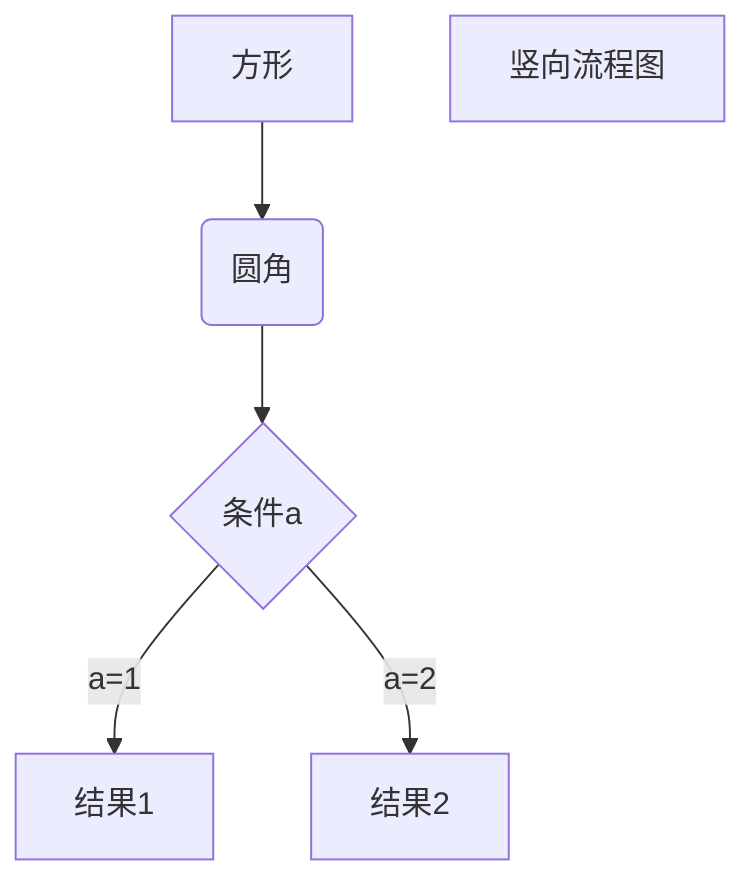
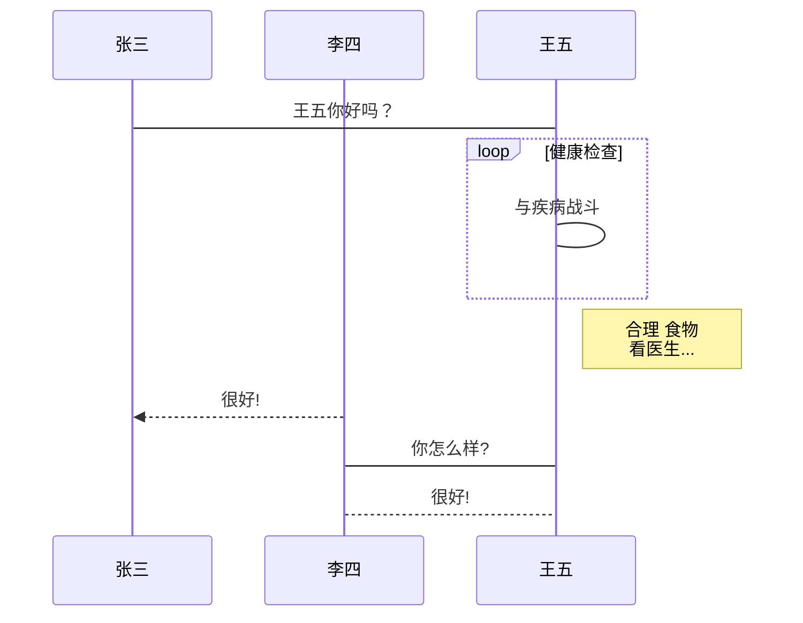
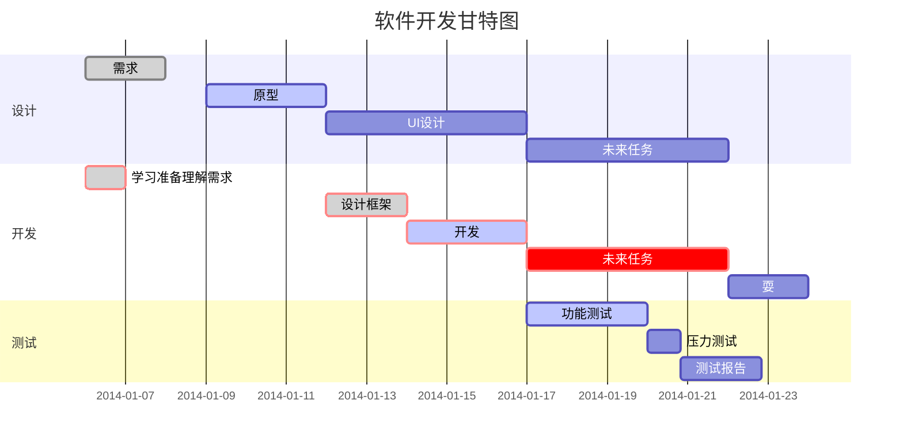

## HTML 元素
目前支持的 HTML 元素有：`<kbd> <b> <i> <em> <sup> <sub> <br>`等 ，如：

使用 <kbd>Ctrl</kbd>+<kbd>Alt</kbd>+<kbd>Del</kbd> 重启电脑

## 转义
```md
**文本加粗** 
\*\* 正常显示星号 \*\*
```
**文本加粗** 
\*\* 正常显示星号 \*\*

需要转义的字符
```md
\   反斜线
`   反引号
*   星号
_   下划线
{}  花括号
[]  方括号
()  小括号
#   井字号
+   加号
-   减号
.   英文句点
!   感叹号
```

## 图表
### 流程图
**1、横向流程图源码格式：**



**2、竖向流程图源码格式：**



**3、标准流程图源码格式：**

```flow
st=>start: 开始框
op=>operation: 处理框
cond=>condition: 判断框(是或否?)
sub1=>subroutine: 子流程
io=>inputoutput: 输入输出框
e=>end: 结束框
st->op->cond
cond(yes)->io->e
cond(no)->sub1(right)->op
```

**4、标准流程图源码格式（横向）：**

```flow
st=>start: 开始框
op=>operation: 处理框
cond=>condition: 判断框(是或否?)
sub1=>subroutine: 子流程
io=>inputoutput: 输入输出框
e=>end: 结束框
st(right)->op(right)->cond
cond(yes)->io(bottom)->e
cond(no)->sub1(right)->op
```

**5、UML时序图源码样例：**

```sequence
对象A->对象B: 对象B你好吗?（请求）
Note right of 对象B: 对象B的描述
Note left of 对象A: 对象A的描述(提示)
对象B-->对象A: 我很好(响应)
对象A->对象B: 你真的好吗？
```

**6、UML时序图源码复杂样例：**

```sequence
Title: 标题：复杂使用
对象A->对象B: 对象B你好吗?（请求）
Note right of 对象B: 对象B的描述
Note left of 对象A: 对象A的描述(提示)
对象B-->对象A: 我很好(响应)
对象B->小三: 你好吗
小三-->>对象A: 对象B找我了
对象A->对象B: 你真的好吗？
Note over 小三,对象B: 我们是朋友
participant C
Note right of C: 没人陪我玩
```

**7、UML标准时序图样例：**



**8、甘特图样例：**



## 数学符号
> 参考链接：[莱斯大学LaTex Math在线PDF手册](https://link.zhihu.com/?target=https%3A//www.caam.rice.edu/~heinken/latex/symbols.pdf)
### 希腊字母
```yaml
大写小写 取决于首字母大小写

大写
$\Gamma$、$\Sigma$、$\Phi$、$\Upsilon$、$\Bbbk$

小写
$\gamma$、$\sigma$、$\iota$、 $\heartsuit$、$\int$、$\oint$
```
大写：
$\Gamma$、$\Sigma$、$\Phi$、$\Upsilon$、$\Bbbk$

小写：
$\gamma$、$\sigma$、$\iota$、 $\heartsuit$、$\int$、$\oint$
### 三角函数、对数、指数

```yaml
$\tan$、$\sin$、$\cos$、$\lg$、$\arcsin$、$\arctan$、$\min$、$\max$、$\exp$、$\log$
```

$\tan$、$\sin$、$\cos$、$\lg$、$\arcsin$、$\arctan$、$\min$、$\max$、$\exp$、$\log$

### 运算符
```yaml
$+$、$-$、$=$、$>$、$<$、$\times$、$\div$、$\equiv$、$\leq$、$\geq$、$\neq$
```

$+$、$-$、$=$、$>$、$<$、$\times$、$\div$、$\equiv$、$\leq$、$\geq$、$\neq$

### 集合符号
```yaml
$\cup$、$\cap$、$\in$、$\notin$、$\ni$、$\subset$、$\subseteq$、$\supset$、$\supseteq$、$\infty$
```

$\cup$、$\cap$、$\in$、$\notin$、$\ni$、$\subset$、$\subseteq$、$\supset$、$\supseteq$、$\infty$

## 数学公式
### 内联输出与块状输出
**内联输出**(所谓内联就是我们可以把数学符号嵌入到文字段落里面，比如：)
```yaml
函数式：$f(x)=\frac{P(x)}{Q(x)}$
```
函数式：$f(x)=\frac{P(x)}{Q(x)}$  

**块状输出**(我们需要输出的数学公式比较复杂，或者我们需要凸出并独立显示公式，这个时候我们就需要使用到公式的块状输出，块状输出的语法使用4个美元符号`$$数学公式$$`)
```yaml
$$f(x)=\frac{P(x)}{Q(x)}$$
```

$$f(x)=\frac{P(x)}{Q(x)}$$  

### 四则运算
```
$2x - 5y =  8$  
$3x + 9y =  -12$
$7x \times 2y \neq 3z$
```

$2x - 5y =  8$  
$3x + 9y =  -12$
$7x \times 2y \neq 3z$

### 指数输出
```yaml
$x^3+x^9+x^y$
```

$x^3+x^9+x^y$

### n次方根输出
`\sqrt{}`是开平方，注意数值使用大括号{}围住，而开n次方的语法是`\sqrt[n]{}`，n次方的n用中括号[]围住，我们来看下面的案例：

```yaml
$\sqrt{3x-1}+\sqrt[5]{2y^5-4}$
```
$\sqrt{3x-1}+\sqrt[5]{2y^5-4}$

### 三角公式
```yaml
$$\cos (2\theta) = \cos^2 \theta - \sin^2 \theta$$
```
$$\cos (2\theta) = \cos^2 \theta - \sin^2 \theta$$

### 输出分数
输出带有分子分母的分数的语法为`\frac{分子}{分母}`，使用大括号把分子、分母都围住。
```yaml
$$\frac{x}{2y} +\frac{x-y}{x+y} $$
```
$$\frac{x}{2y} +\frac{x-y}{x+y} $$

### 求和输出
```yaml
$$\sum_{n=1}^\infty k$$
```

$$\sum_{n=1}^\infty k$$

### 极限的输出
```yaml
$$\lim\limits_{x \to \infty} \exp(-x) = 0$$
```
$$\lim\limits_{x \to \infty} \exp(-x) = 0$$

### 阶乘的输出
```text
$$\frac{n!}{k!(n-k)!} = \binom{n}{k}$$
```
$$\frac{n!}{k!(n-k)!} = \binom{n}{k}$$

### 输出矩阵
```text
$$
  \begin{matrix}
   1 & 2 & 3 \\
   4 & 5 & 6 \\
   7 & 8 & 9
  \end{matrix} 
$$
```

$$
  \begin{matrix}
   1 & 2 & 3 \\
   4 & 5 & 6 \\
   7 & 8 & 9
  \end{matrix} 
$$

```
$$
\begin{Bmatrix}
   a & b \\
   c & d
\end{Bmatrix}
$$
$$
\begin{CD}
   A @>a>> B \\
@VbVV @AAcA \\
   C @= D
\end{CD}
$$
```
$$
\begin{Bmatrix}
   a & b \\
   c & d
\end{Bmatrix}
$$
$$
\begin{CD}
   A @>a>> B \\
@VbVV @AAcA \\
   C @= D
\end{CD}
$$

### 分段函数
```abap
$$
X(m,n)=
\begin{cases}
x(n),\\
x(n-1),\\
x(n+1)
\end{cases}
$$
```
$$
X(m,n)=
\begin{cases}
x(n),\\
x(n-1),\\
x(n+1)
\end{cases}
$$