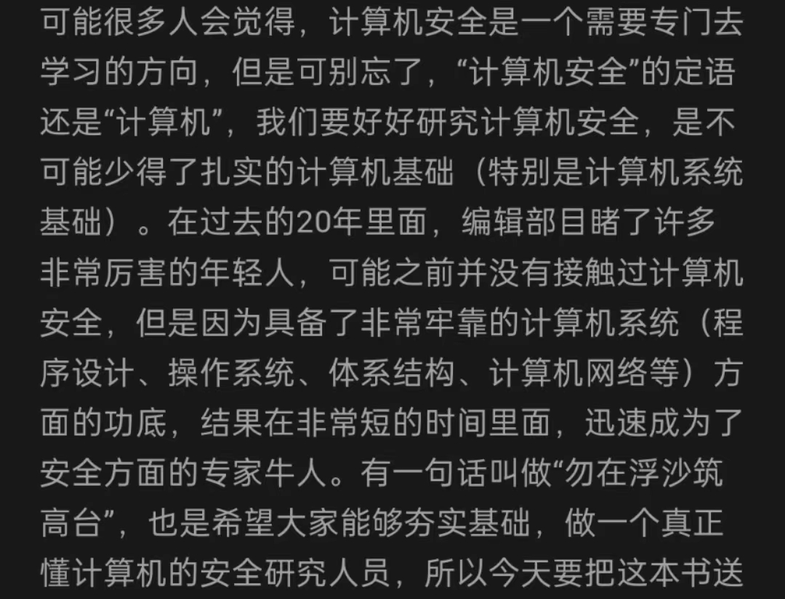

> “勿在浮沙筑高台”  
  

个人学习笔记 obsidian

## 💵Bughunter

### Paper
1. [hackerone-reports](https://github.com/reddelexc/hackerone-reports)  
2. [pentester.land](https://pentester.land/writeups/)  
3. [AllAboutBugBounty](https://github.com/daffainfo/AllAboutBugBounty)
4. [portswigger](https://portswigger.net/)
### Video
1. [Recon for Ethical Hacking渗透测试漏洞赏金](https://mega.nz/folder/CDphRCJB#eBZqSmleyW6Thld_8RbZwQ)

### Tips
1. [KingOfBugBountyTips](https://github.com/0x13v/KingOfBugBountyTips)
2. [One-Liners](https://github.com/0xPugazh/One-Liners)

## 🎄AI

参考链接：  
[（吴恩达）机器学习教程中文笔记](https://github.com/fengdu78/Coursera-ML-AndrewNg-Notes)  
[动手学深度学习](https://github.com/d2l-ai/d2l-zh)

