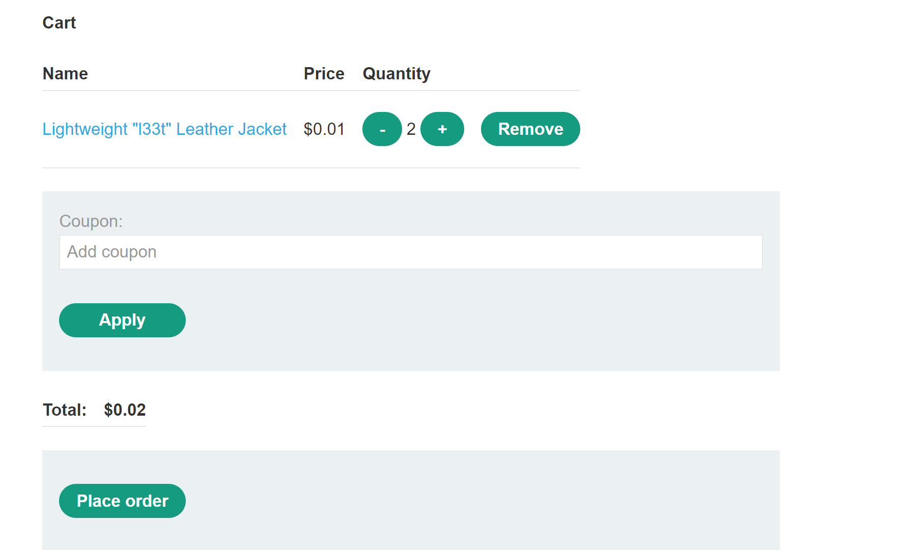
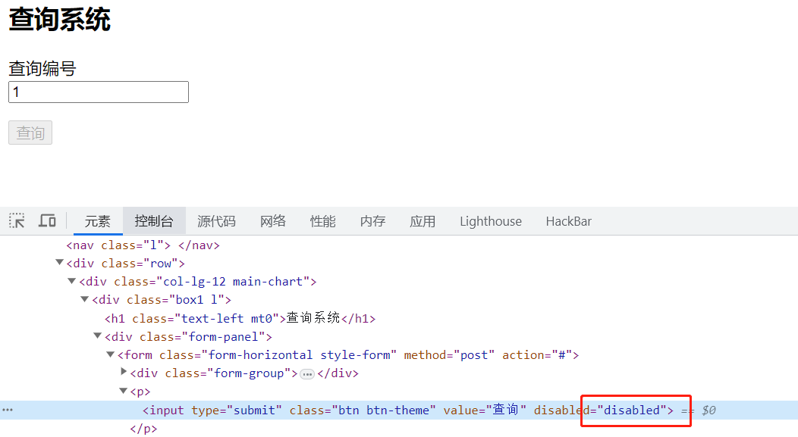
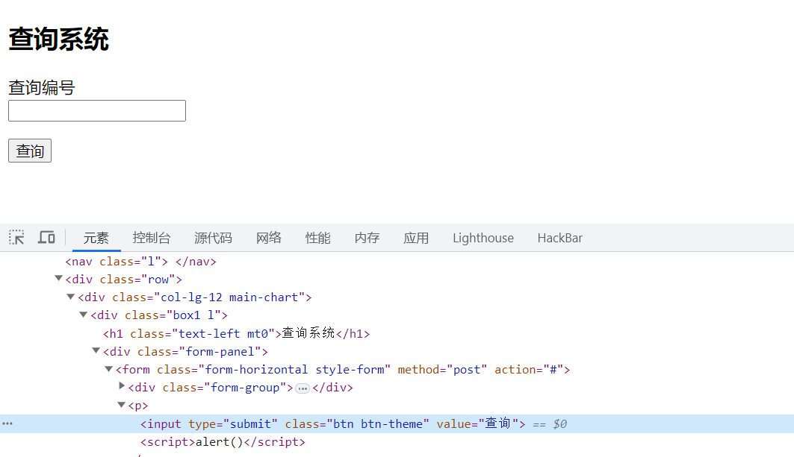
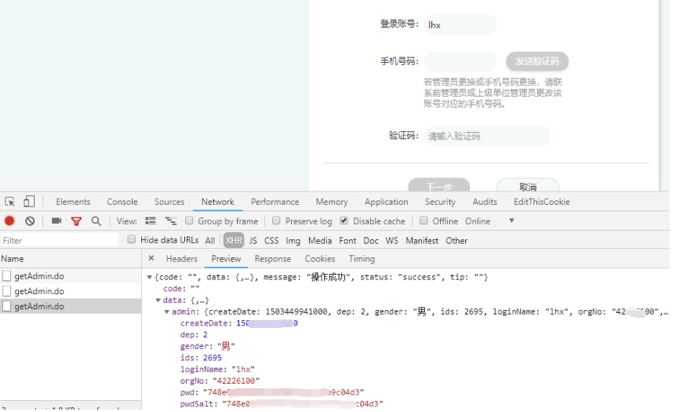

## 什么是业务逻辑漏洞
> 业务逻辑漏洞是指应用程序设计和实现中的缺陷，允许攻击者引发意外行为。这可能使攻击者能够操纵合法功能以实现恶意目标。这些缺陷通常是由于未能预测可能发生的异常应用状态，因此未能安全地处理这些缺陷。


## 实验室

### [Excessive trust in client-side controls](https://portswigger.net/web-security/logic-flaws/examples#excessive-trust-in-client-side-controls)

> 过度信任客户端，一个根本上有缺陷的假设是，用户只会通过提供的Web界面与应用程序交互。

#### Lab1 修改商品价格(前端)
1. 皮夹克价格
2. 购买，抓包
3. 修改13700为0.1
4. 付款
5. 影响：💵接受表面价值的数据，而不执行适当的完整性检查和服务器端验证，可以允许攻击者以相对最小的努力造成各种破坏。
#### Lab2 2FA broken logic

#### Lab3 突破功能限制
1. 无法查询： 

2. 删除dis关键字


#### Lab4 数组突破优惠券限制
> 一般每张优惠券都是一段随机字符串key标识，一次只允许使用一张，但有些语言支持  
1. 数组
```bash
copponeid=keyA
copponeid[0]=keyA&copponeid[1]=keyB
```
2. json
```bash
{......"copponeid":"keyA",....}
{......"copponeid":["keyA","keyB"],....}
```

#### Lab5 突破功能限制漏洞--限额
每人每天只允许购买10000元的产品，但每个人都已修改自己每天能购买的最大限额数（仅能由大改小）
```bash
买10000
将额度改为9999
再买9999
突破限制
```

### [Failing to handle unconventional input](https://portswigger.net/web-security/logic-flaws/examples#excessive-trust-in-client-side-controls)

#### Lab1 High-level logic vulnerability
1. 增加-数量商品至购物车

2. 购买足够多的其余商品，使得总价格不低于0，购买


#### Lab2 Low-level logic flaw


### [Information disclosure vulnerabilities](https://portswigger.net/web-security/information-disclosure)
> 泄露信息一般为手机号/姓名/邮箱/身份证号/收获地址/订单/用户名/密码/银行卡等
#### 注册 登录 找回密码，服务器回显差异造成泄露
```bash
用户名不存在
用户名或密码错误
通过回显不同，字典遍历，获取系统中可能存在的用户名列表
同理手机号/邮箱等
```
#### 服务端多余回显
用户登录之后服务器会从数据库读取用户数据，并通过js或json返回给前端，以便于前端一些功能快速响应（同时可能造成不必要的数据回显（密码等））

#### 掩码前后不一致造成信息泄露
```bash
A功能点：手机号135xxxxx1010
B功能点：手机号13535356XXXX
```
## 扩展

### Paper
[业务逻辑漏洞](https://portswigger.net/web-security/logic-flaws)