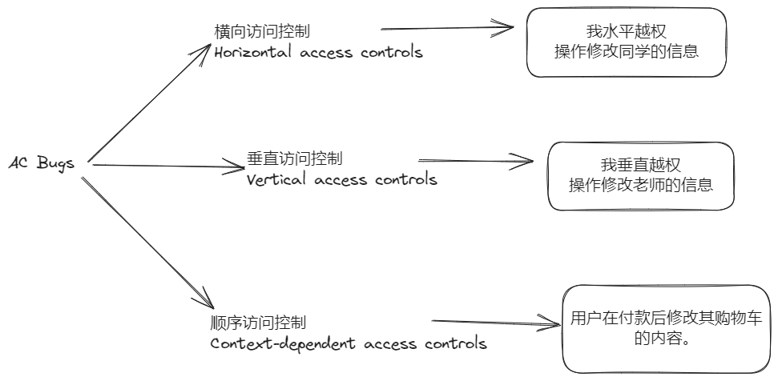
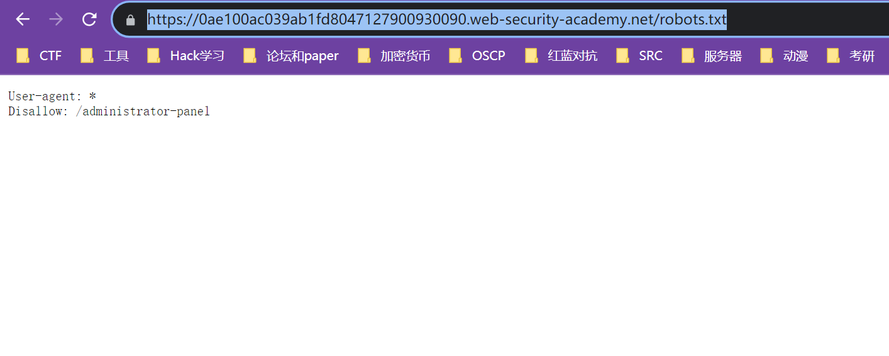
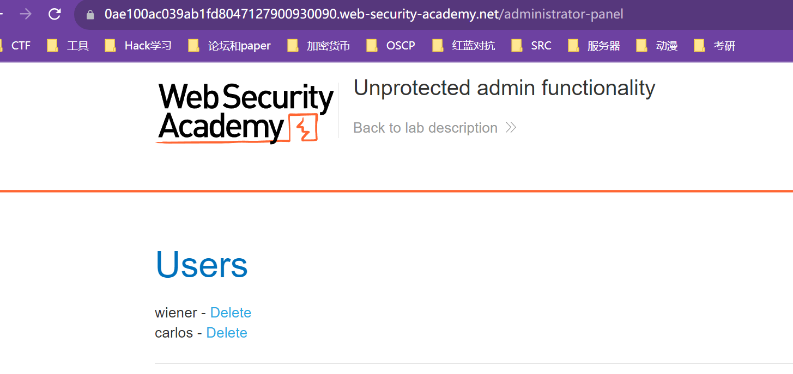

## 什么是AC Bugs？

## 实验室
### Vertical privilege escalation
> 仅通过`隐藏目录`/`判断参数`来权限控制是不安全的（爆破url/爬虫/robots.txt/Fuzz/jsfinder）
#### Unprotected functionality
1. 访问robots.txt

2. 得到隐藏目录，访问目录 ，删除用户


####  Unprotected admin functionality with unpredictable URL

1. 查看源代码，发现隐藏目录

2. 访问删除


#### Parameter-based access control methods
参数控制权限
```html
https://insecure-website.com/login/home.jsp?admin=true
https://insecure-website.com/login/home.jsp?role=1
```

### Horizontal access controls

### 横向到垂直权限升级 

### 不安全的直接对象引用（IDOR）

### 多步骤流程中的访问控制漏洞

### 基于引用者的访问控制

### 基于位置的访问控制

## 防御

## 扩展
### Paper
[access-control](https://portswigger.net/web-security/access-control)
[security-models](https://portswigger.net/web-security/access-control/security-models)